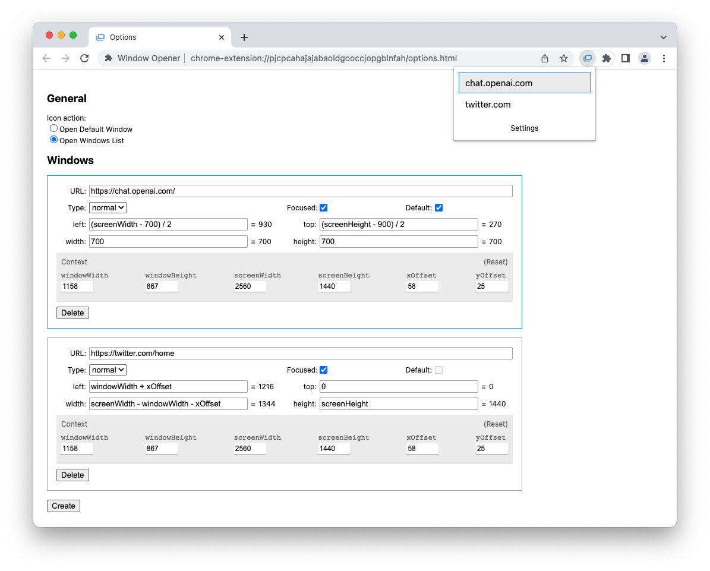

# Window Opener

A Chrome extension for opening windows with customized size and position in one click.

## TODO

- [x] add "Open" button in WindowsManager
- [x] add confirmation for "Delete" button in WindowsManager
- [ ] add tooltip for context data
- [ ] add name for windows, display name and domain in windows list in popup
- [ ] create new window data from the current window
- [ ] support keyboard shortcut
- [ ] focus on opened window
- [ ] export/import settings
